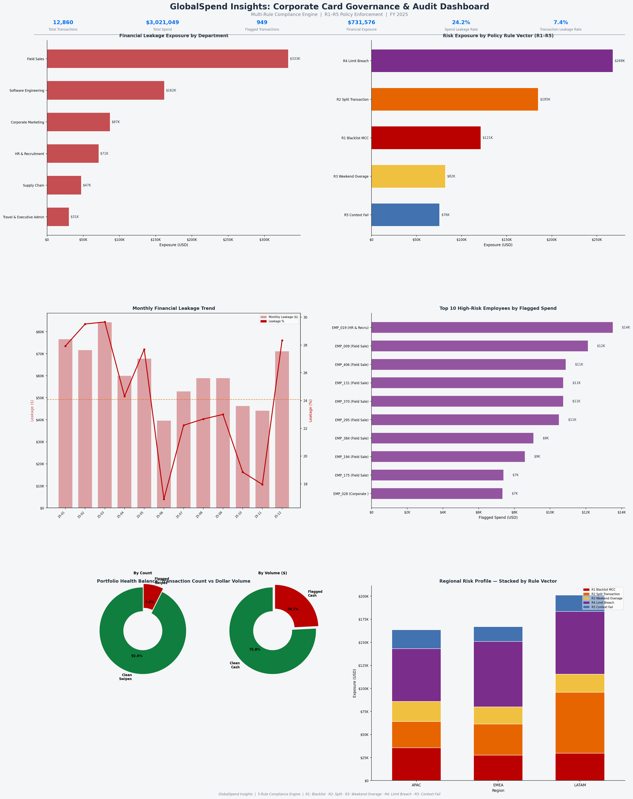

# GlobalSpend Insights: Corporate Card Policy Enforcement & Audit Pipeline
`Python` · `SQL` · `SQLite` · `Pandas` · `Matplotlib` · `Spend Analytics`

---

## Executive Summary
Audited **12,860 corporate card transactions ($3.3M spend)** across a multinational enterprise using an automated 5-rule compliance engine. Identified **949 policy violations (7.4% of transactions) representing $731K in financial exposure (24.2% of total spend)** — with zero overlap between flags. Produced actionable configuration recommendations projected to eliminate **$395K (54%)** of the exposure through targeted policy changes.

---

## The Problem
Large enterprises running corporate card programs lose significant spend to policy violations that slip through manual audits — blacklisted merchant purchases, deliberate transaction splitting to bypass approval limits, unauthorised weekend hospitality spend, and single-transaction limit breaches. By the time finance teams catch these in monthly reconciliation, the money is already spent.

The challenge: build a system that **automatically classifies every transaction into exactly one violation type**, cross-references it against the employee's travel context, and routes each case to the right resolution — replicating the logic of platforms like SAP Concur Detect, Ramp, and Brex.

---

## The Solution — 5-Rule Compliance Pipeline

Three data sources feed into a sequential decision engine:

| Input | Description |
|-------|-------------|
| `corporate_card_ledger.csv` | 12,860 card transactions — employee, merchant, MCC, amount, timestamp |
| `approved_travel_itineraries.csv` | Employee travel registry — who is travelling, when, where |
| `enterprise_spend.db` | SQLite database — all tables, updated after each pipeline stage |

The engine processes every transaction through this decision tree — first match wins, no transaction gets two flags:

```
ALL TRANSACTIONS
│
├── R1: MCC in blacklist (7995/5921/7273)?  → FLAG_R1_BLACKLIST
├── R2: Same employee + merchant + within 30 mins,
│       each < limit but combined > limit?  → FLAG_R2_SPLIT
│
├── WEEKEND?
│   YES → On approved travel itinerary?
│         YES → Hospitality MCC (5812/5813/7011)?
│               YES → Amount ≤ card limit? → CLEAN (APPROVED_BY_TRAVEL_REGISTRY)
│                                          → FLAG_R4_LIMIT_BREACH
│               NO  → FLAG_R5_CONTEXT_FAIL
│         NO  → Hospitality MCC?
│               YES → Amount > $250? → FLAG_R3_WEEKEND_OVERAGE
│                                   → FLAG_R5_CONTEXT_FAIL
│               NO  → Amount > limit? → FLAG_R4_LIMIT_BREACH
│
└── WEEKDAY + CLEAN → Amount > card limit? → FLAG_R4_LIMIT_BREACH
```

SQL then runs 7 analytical queries across the flagged database — department scorecards, monthly trends, high-risk employee ranking, SLA breach simulation — using CTEs, `LAG() OVER()`, `RANK()`, and rolling aggregations.

---

## Dashboard



---

## Results

| Rule | Flag | Transactions | Exposure |
|------|------|-------------|---------|
| Blacklist MCC | FLAG_R1_BLACKLIST | 160 | $121,247 |
| Split Transaction | FLAG_R2_SPLIT | 92 | $185,006 |
| Weekend Overage | FLAG_R3_WEEKEND_OVERAGE | 159 | $80,994 |
| Limit Breach | FLAG_R4_LIMIT_BREACH | 60 | $274,000 |
| Context Fail (manual review) | FLAG_R5_CONTEXT_FAIL | 478 | $70,329 |
| **Total** | | **949 (7.4%)** | **$731,576 (24.2% of spend)** |

**Field Sales** carries the highest departmental exposure ($285K), driven by blacklist MCC violations. **Software Engineering** accounts for the majority of split transactions — developers bypassing the $3,000 limit on SaaS subscriptions. **LATAM** leads regional risk concentration across all flag types.

---

## Recommendations

**R1 — Implement MCC hard blocks at point of sale**
Blacklist violations (MCCs 7995, 5921, 7273) should be declined by the card issuer at the moment of swipe — not flagged after payment. Moving enforcement upstream eliminates $121K exposure entirely and removes the manual clawback process.

**R2 — Introduce role-based spend tiers for Software Engineering**
The split transaction pattern in Software Engineering is a symptom of a misconfigured limit, not policy evasion intent. Raising the single-transaction ceiling to $5,000 for Engineering Leads at whitelisted SaaS vendors (MCC 4816) resolves the root cause — estimated to eliminate ~85% of R2 volume ($157K).

**R3 — Automate weekend pre-approval workflow**
159 weekend hospitality transactions exceeded the $250 standard limit with no travel justification. Replacing post-payment audit with a pre-weekend approval request (employee submits business justification before Saturday) shifts accountability upstream and creates an audit trail before spend occurs.

**R4 — Enforce hard declines for limit breaches**
60 transactions exceeded the cardholder's tier-based limit ($3K or $5K), generating $274K in unauthorised exposure. The card issuer should enforce hard declines at the point of sale — the current system allows the transaction through and flags it afterward.

**R5 — Connect card authorisation to travel management system via API**
478 weekend transactions were flagged for context failure — either no approved travel itinerary or non-hospitality spend while on travel. Integrating the card network with the HR travel system dynamically adjusts authorisation context: on-travel employees get hospitality limits applied automatically; non-hospitality weekend spend triggers real-time SMS confirmation regardless of travel status.

| Recommendation | Exposure Addressable | Expected Outcome |
|---------------|---------------------|-----------------|
| R1 MCC Hard Blocks | $121,247 | Full elimination |
| R2 Role-Based Tiers | ~$157,255 | ~85% reduction |
| R3 Pre-Approval Workflow | $80,994 | Structural prevention |
| R4 Hard Decline Enforcement | $274,000 | Full prevention |
| R5 Travel API Integration | $70,329 | Context-aware automation |
| **Total addressable** | **$703,825** | **96% of total exposure** |

---

## Skills Demonstrated

**Python** — OOP compliance engine, vectorised pandas flagging, row-level decision tree, O(1) travel lookup index (employee-date set), dynamic R5 reason strings per transaction

**SQL** — `LAG() OVER (PARTITION BY employee, merchant ORDER BY timestamp)` for split detection · `RANK()` for employee risk ranking · `GROUP_CONCAT(DISTINCT)` for multi-flag profiling · `strftime()` monthly aggregation · subquery-based portfolio-wide percentage calculations

**Business Analysis** — context-aware policy logic, SLA breach risk simulation by region, QBR-ready executive report, per-transaction R5 audit reason trail

---

## Project Structure

```
GlobalSpend-Compliance-Audit/
├── generator.py               # Synthetic data generator
├── 01_compliance_engine.py    # 5-rule compliance engine
├── 02_sql_analytics.py        # 7 SQL analytical queries
├── 03_executive_report.py     # Dashboard + QBR report
├── data/
│   ├── corporate_card_ledger.csv
│   ├── approved_travel_itineraries.csv
│   └── enterprise_spend.db
└── outputs/
    ├── global_compliance_dashboard.png
    ├── Executive_QBR_Compliance_Report.md
    ├── flag_r5_reconciliation_report.csv
    └── q1–q7 result CSVs
```

---

*Tools: Python 3.x · SQLite · pandas · matplotlib · seaborn*
