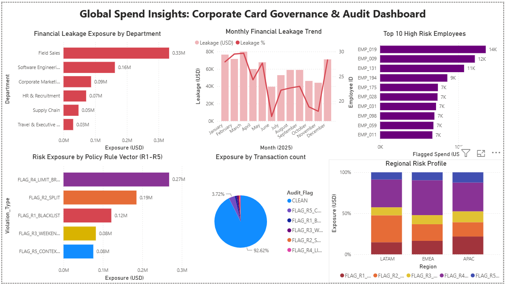

# GlobalSpend Insights: Corporate Card Policy Enforcement & Audit Pipeline
`Python` · `MySQL` · `pandas` · `matplotlib` · `Power BI` · `Spend Analytics` · `Fraud Detection`

---

## Executive Summary

Audited **12,860 corporate card transactions ($3.3M spend)** across a multinational enterprise using an automated 5-rule compliance engine. Identified **949 policy violations (7.4% of transactions) representing $731K in financial exposure (24.2% of total spend)** with zero overlap between flags. Produced actionable configuration recommendations projected to eliminate **96% ($703K) of the exposure** through targeted policy and system changes.

---

## The Problem

Large enterprises running corporate card programs lose significant spend to policy violations that slip through manual audits — blacklisted merchant purchases, deliberate transaction splitting to bypass approval limits, unauthorised weekend hospitality spend, and single-transaction limit breaches. By the time finance teams catch these in monthly reconciliation, the money is already spent.

The challenge: build a system that automatically classifies every transaction into exactly one violation type, cross-references it against the employee's travel context, and routes each case to the right resolution — replicating the logic of platforms like SAP Concur Detect, Ramp, and Brex.

---

## Dataset

**Synthetic enterprise dataset** — Generated to replicate real-world corporate card program data at multinational scale. Designed to mirror the structure of SAP Concur, Ramp, and Brex transaction exports.

| File | Description |
|------|-------------|
| `corporate_card_ledger.csv` | 12,860 card transactions — employee, merchant, MCC, amount, timestamp |
| `approved_travel_itineraries.csv` | Employee travel registry — who is travelling, when, where |

> Data generated using `generator.py` included in the repository. All values are synthetic and do not represent real individuals or organisations.

---

## The Solution — 5-Rule Compliance Pipeline

Three data sources feed into a sequential decision engine:

```
ALL TRANSACTIONS (12,860)
│
├── R1: MCC in blacklist (7995/5921/7273)?
│         YES -> FLAG_R1_BLACKLIST
│
├── R2: Same employee + merchant + within 30 mins,
│         each < limit but combined > limit?
│         YES -> FLAG_R2_SPLIT
│
├── WEEKEND?
│   YES -> On approved travel itinerary?
│         YES -> Hospitality MCC (5812/5813/7011)?
│               YES -> Amount <= card limit? -> CLEAN (APPROVED_BY_TRAVEL_REGISTRY)
│                                            -> FLAG_R4_LIMIT_BREACH
│               NO  -> FLAG_R5_CONTEXT_FAIL
│         NO  -> Hospitality MCC?
│               YES -> Amount > $250?  -> FLAG_R3_WEEKEND_OVERAGE
│                                      -> FLAG_R5_CONTEXT_FAIL
│               NO  -> Amount > limit? -> FLAG_R4_LIMIT_BREACH
│
└── WEEKDAY + CLEAN -> Amount > card limit? -> FLAG_R4_LIMIT_BREACH
```

First match wins. No transaction receives two flags. Every transaction exits with exactly one classification.

MySQL then runs 7 analytical queries across the flagged database — department scorecards, monthly trends, high-risk employee ranking, regional risk concentration, SLA breach simulation — using CTEs, `LAG() OVER()`, `RANK()`, and rolling aggregations.

---

## Dashboard

*Built with Power BI — using flagged transaction outputs from the compliance engine and MySQL query result CSVs.*



> Supporting chart exports and query result CSVs: [`outputs/`](outputs/)

---

## Results

| Rule | Flag | Transactions | Exposure (USD) |
|------|------|-------------|----------------|
| Blacklist MCC | FLAG_R1_BLACKLIST | 160 | $121,247 |
| Split Transaction | FLAG_R2_SPLIT | 92 | $185,006 |
| Weekend Overage | FLAG_R3_WEEKEND_OVERAGE | 159 | $80,994 |
| Limit Breach | FLAG_R4_LIMIT_BREACH | 60 | $274,000 |
| Context Fail | FLAG_R5_CONTEXT_FAIL | 478 | $70,329 |
| **Total** | | **949 (7.4%)** | **$731,576 (24.2% of spend)** |

**Field Sales** carries the highest departmental exposure ($285K), driven by blacklist MCC violations. **Software Engineering** accounts for the majority of split transactions — developers bypassing the $3,000 limit on SaaS subscriptions. **LATAM** leads regional risk concentration across all flag types.

---

## Business Questions & Answers

Real business questions this analysis is designed to answer — with findings drawn directly from the data.

**Q1. Which department poses the highest fraud risk and what is driving it?**

Field Sales carries $285K in total exposure — the highest of any department. The primary driver is blacklist MCC violations (gambling, liquor, adult entertainment), suggesting either deliberate misuse or inadequate cardholder policy awareness. A point-of-sale MCC hard block would eliminate this exposure entirely without requiring post-payment clawback.

**Q2. Which violation type represents the most recoverable exposure with the least operational change?**

FLAG_R4_LIMIT_BREACH represents $274K in exposure across just 60 transactions — the highest average exposure per transaction of any rule ($4,567 per breach). Recovery requires a single configuration change: enabling hard declines at the card issuer level for transactions exceeding tier-based limits. No process redesign or employee training needed — full prevention from one system change.

**Q3. Are there employees appearing across multiple violation categories, and what does that signal?**

The R5 reconciliation report surfaces 478 context-fail transactions with per-transaction reason strings identifying two distinct patterns — employees with no travel approval spending on weekends, and employees on approved travel spending outside hospitality MCCs. Employees appearing in both R2 (split) and R5 (context fail) categories represent the highest individual risk profile and should be prioritised for targeted audit.

**Q4. Which regional office should be prioritised for an immediate compliance audit?**

LATAM leads risk concentration across all flag types. The regional risk profile shows disproportionate exposure relative to transaction volume, with blacklist MCC violations (R1) and split transactions (R2) both concentrated in this region. An immediate audit of LATAM cardholder spend with tightened MCC restrictions is the highest-priority regional intervention.

**Q5. If only two rules could be fixed this quarter, which two deliver maximum exposure recovery?**

R4 (Limit Breach, $274K, full prevention via one config change) and R2 (Split Transactions, $185K, ~85% recovery via role-based spend tier increase for Software Engineering at whitelisted SaaS vendors). Combined addressable exposure: $459K — 63% of total exposure resolved with two targeted interventions, no process redesign required.

---

## Recommendations

**R1 — Implement MCC hard blocks at point of sale**
Decline blacklisted MCC transactions (7995, 5921, 7273) at the card issuer level at point of swipe, eliminating post-payment clawback entirely and recovering $121K in exposure.

**R2 — Introduce role-based spend tiers for Software Engineering**
Raise the single-transaction ceiling to $5,000 for Engineering Leads at whitelisted SaaS vendors (MCC 4816) to resolve the root cause of split transaction behaviour and eliminate ~85% of R2 volume ($157K).

**R3 — Automate weekend pre-approval workflow**
Require employees to submit a business justification before Saturday for hospitality spend above $250, shifting accountability upstream and creating an audit trail before spend occurs.

**R4 — Enforce hard declines for limit breaches**
Configure card issuer to enforce hard declines at point of sale for transactions exceeding tier-based limits ($3K or $5K), preventing $274K in unauthorised exposure at source.

**R5 — Connect card authorisation to travel management system via API**
Integrate the card network with the HR travel system to dynamically adjust spend context in real time — on-travel employees receive hospitality limits automatically; non-hospitality weekend spend triggers SMS confirmation.

| Recommendation | Exposure Addressable | Expected Outcome |
|---------------|---------------------|-----------------|
| R1 MCC Hard Blocks | $121,247 | Full elimination |
| R2 Role-Based Tiers | ~$157,255 | ~85% reduction |
| R3 Pre-Approval Workflow | $80,994 | Structural prevention |
| R4 Hard Decline Enforcement | $274,000 | Full prevention |
| R5 Travel API Integration | $70,329 | Context-aware automation |
| **Total addressable** | **$703,825** | **96% of total exposure** |

> For detailed findings behind each recommendation: [Executive_QBR_Compliance_Report.md](Executive_QBR_Compliance_Report.md)

---

## Skills Demonstrated

**Python** — OOP compliance engine, vectorised pandas flagging, row-level decision tree with sequential rule evaluation, O(1) travel lookup index using employee-date sets, dynamic R5 reason string generation per transaction

**MySQL** — `LAG() OVER (PARTITION BY employee, merchant ORDER BY timestamp)` for split detection · `RANK()` for employee risk ranking · `GROUP_CONCAT(DISTINCT)` for multi-flag profiling · monthly aggregation using `DATE_FORMAT()` · subquery-based portfolio-wide percentage calculations · CTEs for department scorecards

**Business Analysis** — context-aware compliance logic, SLA breach risk simulation by region, QBR-ready executive report, per-transaction audit reason trail, fraud exposure quantification with prioritised recovery recommendations

---

## Project Structure

```
GlobalSpend-Compliance-Audit/
├── README.md
├── Executive_QBR_Compliance_Report.md
│
├── generator.py                    <- synthetic data generator
├── 01_compliance_engine.py         <- 5-rule compliance engine
├── 02_sql_analytics.py             <- 7 MySQL analytical queries
├── 03_executive_report.py          <- dashboard + QBR report
│
├── data/
│   ├── corporate_card_ledger.csv
│   ├── approved_travel_itineraries.csv
│   └── enterprise_spend.db
│
└── outputs/
    ├── corporate_card_powerbi_dashboard.png
    ├── global_compliance_dashboard.png
    ├── Executive_QBR_Compliance_Report.md
    ├── flag_r5_reconciliation_report.csv
    └── q1-q7 result CSVs
```

---

## Setup

```bash
pip install pandas matplotlib seaborn mysql-connector-python

python generator.py
python 01_compliance_engine.py
python 02_sql_analytics.py
python 03_executive_report.py
```

*Tools: Python 3.x · MySQL 8.0 · pandas · matplotlib · seaborn · Power BI*
